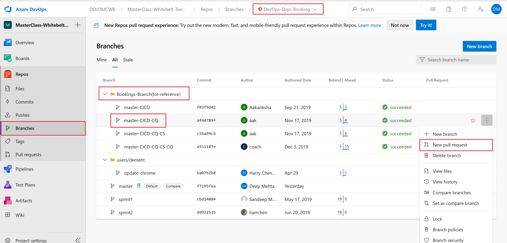
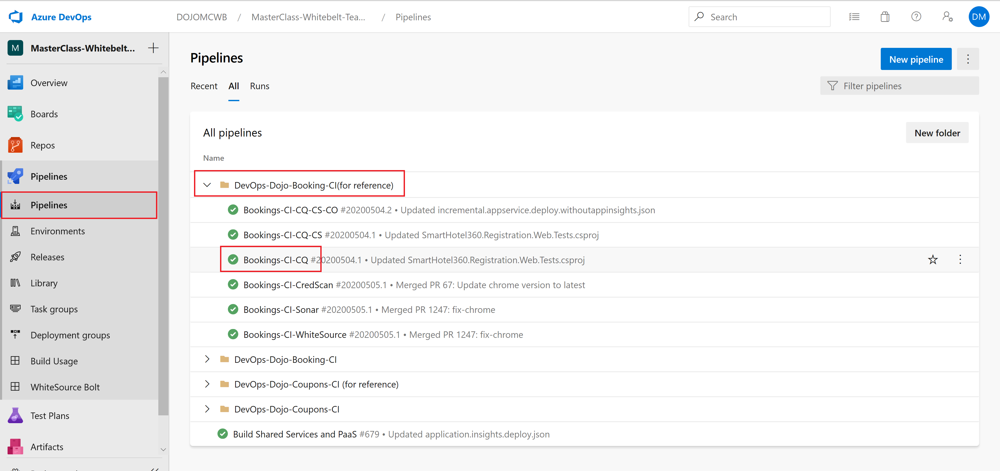
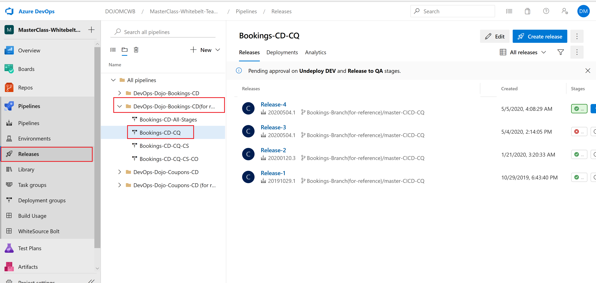

**[Home](../Labs.md) | [Module 1-Code changes for CQ](../Labs/CQ-Bookings-App-Net/Module-1-Code-Changes-CQ\(.Net\)) | [Module 2-Build Pipeline Changes for CQ](/4-Continuous-Quality/Labs/CQ-Bookings-App-Net/Module-2-Build-Pipeline-Changes-CQ\(.Net\))| [Module 3-Release Pipeline changes for CQ](/4-Continuous-Quality/Labs/CQ-Bookings-App-Net/Module-3-Release-Pipeline-Changes-CQ\(.Net\))  |**

[[_TOC_]]

# Objective
The objective of the following labs is to understand the  implementation of Continuous Quality (CQ) in a real scenario example in regards to continuously testing, finding and fixing defects during all phases of the development cycle. 

The labs focus on the following steps: 
1. **Enabling shift left testing** by implementing different type of tests. 
2. E**nabling Unit Tests** in the build pipeline to test small parts of the application easily. 
3. Adding **functional BDD tests** in the QA environment in the release pipeline. 
4. Adding **UI Tests in the SIT environment** in the release pipeline.
	
# Labs - Modules
- #### [Module 1: Code changes for CQ](/4-Continuous-Quality/Labs/CQ-Bookings-App-Net/Module-1-Code-Changes-CQ\(.Net\))
- #### [Module 2: Build pipeline changes for CQ](/4-Continuous-Quality/Labs/CQ-Bookings-App-Net/Module-2-Build-Pipeline-Changes-CQ\(.Net\))
- #### [Module 3: Release pipeline changes for CQ](/4-Continuous-Quality/Labs/CQ-Bookings-App-Net/Module-3-Release-Pipeline-Changes-CQ\(.Net\))

# Key takeaways
The Key takeaways of these labs are: 
- **Enabling shift left testing** using Test Driven Development for quality code and detect bugs earlier.
- **Implementing search feature** using Behavior Driven development and Test Driven Development approach.
- Understanding the importance and implementation of functional and non-functional tests like **unit, integration, UI and performance tests**.

# Fallback scenario
Whether you won't be able to complete all the steps of the labs, refer to the reference branches to continue with the next exercises.

*Reference Branch:*

Compare your build and release pipelines with the reference ones.

*Reference Build Pipeline:*

*Reference Release Pipeline:*

