**[Home](/4-Continuous-Quality/Labs/CQ-Bookings-App-Net) | [Module 1-Code changes for CQ](/4-Continuous-Quality/Labs/CQ-Bookings-App-Net/Module-1-Code-Changes-CQ\(.Net\)) | [Module 2-Build Pipeline Changes for CQ](/4-Continuous-Quality/Labs/CQ-Bookings-App-Net/Module-2-Build-Pipeline-Changes-CQ\(.Net\))| [Module 3-Release Pipeline changes for CQ](/4-Continuous-Quality/Labs/CQ-Bookings-App-Net/Module-3-Release-Pipeline-Changes-CQ\(.Net\))  |**

[[_TOC_]]

## Module 1 : Enabling Shift Left Testing in Booking Application (Visual Studio IDE)

 >**NOTE** Shift-left testing is the approach of taking the action of testing your software and moving it to the left in the delivery pipeline for testing your software earlier in the development lifecycle than is historically typical.

In this module we will integrate quality in our bookings application by enabling below types of tests:

- **[Unit Tests](#exercise-1-%3A-for-enabling-unit-tests-in-the-bookings-source-code)**: These are small, low cost, single unit coverage tests which can detect problems at the earliest stages of development. For more information on how to create unit tests from scratch and TDD approach, click **[here](/4-Continuous-Quality/Reference/DotNetTests)**.

- **[Integration Tests](#exercise-2-%3A-for-enabling-functional-bdd-test-in-the-bookings-source-code)**: Functional testing is performed using the functional specification provided by the client and verifies the system against the functional requirements.
Business requirements are the inputs to functional testing.
Functional testing describes what the feature does. We have implemented feature called **`search customer based on customer's first name`** using Behavior Driven Development(BDD). For more information on detailed information on implementation of functional tests using BDD, click **[here](/4-Continuous-Quality/Reference/DotNetTests.md#introduction-to-bdd)**

- **[UI Tests](#exercise-3-%3A-for-enabling-ui-test)**: User interface testing, a testing technique used to identify the presence of defects is a product/software under test by using Graphical user interface [GUI]. For more details related to Automated UI Tests click [here](https://docs.microsoft.com/en-us/azure/devops/pipelines/test/continuous-test-selenium?view=azure-devops).

### Exercise 1 : Enabling Unit Tests in the Bookings Source Code

 This exercise covers unit tests that are already implemented using [moq framework](https://docs.microsoft.com/en-us/ef/ef6/fundamentals/testing/mocking).

>**NOTE** Create a new local branch from master to ensure all your changes are into one branch

1. Open the Bookings Project in Visual Studio. Go to  `SmartHotel360.Registration.Web.Tests-> BusinessLogicUnitTests->BookingsManagerTest.cs` in Solution Explorer View.
    
    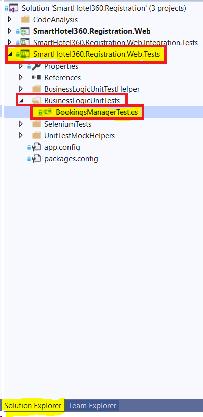  

2. **DELETE** the **Ignore** Attribute as highlighted in the image on line no 12.
    
    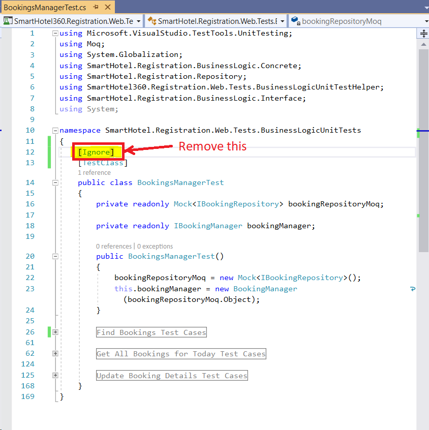

3. To open Test Explorer Window, Go to `Test->Windows->Test Explorer`.  
    
    

4. Right click and build the **SmartHotel360.Registration.Web.Tests** as shown below in Solution Explorer.

    
    
5. To run the unit Test in BookingsManagerTest Class, Go to Test Explorer Window and right click on **SmartHotel360.Registration.Web.Tests.BusinessLogicUnitTests** -> **Run Selected Tests**.

    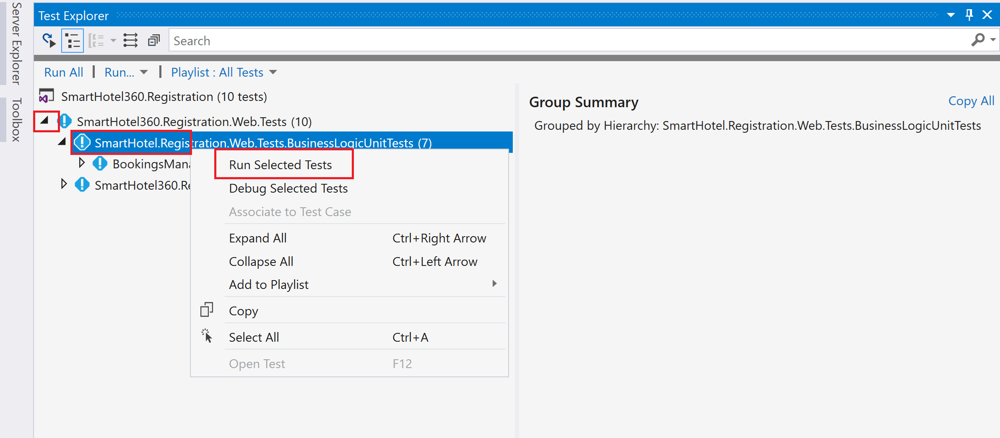

  >**NOTE**  Ignore the tests not run as shown in the image. It shows the tests are being skipped just for informational purpose.

6. Once the test ran successfully, you should be able to see the status as **Green** for all the seven unit tests.
  
     

### Exercise 2 : Enabling Functional BDD Test in the Bookings Source Code

In this exercise we are using BDD approach for integration tests or other types of tests, such as unit tests, because the steps definitions determines what the tests are doing behind the scene.

**Background:** `SearchGuestsByFirstName` feature is not implemented in bookings application. Requirement definitions for `SearchGuestsByFirstName` feature is written in feature file using [gherkin language](https://cucumber.io/docs/gherkin/). Executing Your First Test related to `SearchGuestsByFirstName` feature will fail the test. Next cycle we will implement the automation code and run tests again which should pass the tests.

1. Go to `SmartHotel360.Registration.Web.Integration.Tests -> GuestSearchByNameSteps.cs` step definition file. **Uncomment** the commented section under red-boxed section.

    

2. Go to App.config in the solution explorer from `SmartHotel360.Registration.Web.Integration.Tests -> App.Config `as shown below:

    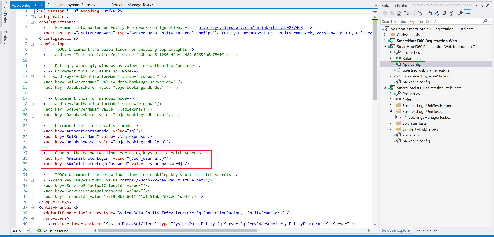
   
3. Update the config key **AdministratorLogin** and **AdministratorLoginPassword** using the values as shown below:
    >**AdministratorLogin**: sa
  
    >**AdministratorLoginPassword**: devadmin@123
    
    

    >**NOTE**: **Step 3** asks you to put sql server credentials in config file. This is poor practice and done intentionally to highlight usage of Key Vault & CredScan later on.

4. Right click and **build** the **SmartHotel360.Registration.Web.Integration.Tests** as shown below.

    

#### Executing BDD Test | Fail

 Executing Your First Test related to `SearchGuestsByFirstName` feature will fail the test as there is no underlying implementation of the functionality.

1. To open Test Explorer Window, Go to `Test->Windows->Test Explorer`.  
    
    

	Scenarios are displayed with their plain text scenario title instead of a generated unit test name.

2. Right Click on **SearchBasedOnTheFirstName** ->  **Run Selected Tests** to run your test. 

   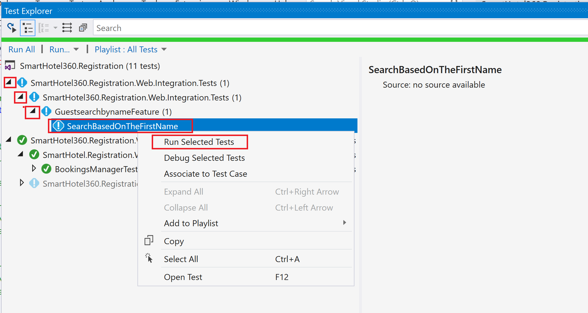

3. First test will fail as the **SearchGuestByFirstName** method inside `SmartHotel360.Registration.Web->BusinessLogic->Concrete->BookingManager.cs` is not yet implemented.
   
   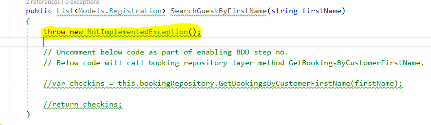

4. Verify the results of first run of BDD as shown below:
     
    

5. Open the file `SmartHotel360.Registration.Web->BusinessLogic->Concrete->BookingManager.cs` **SearchGuestByFirstName** method will look like as per the below image.

   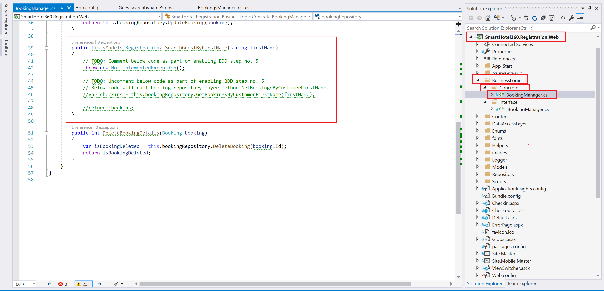

    Follow the steps mentioned within the method **SearchGuestByFirstName** of commenting & uncommenting. The method will look like this:

    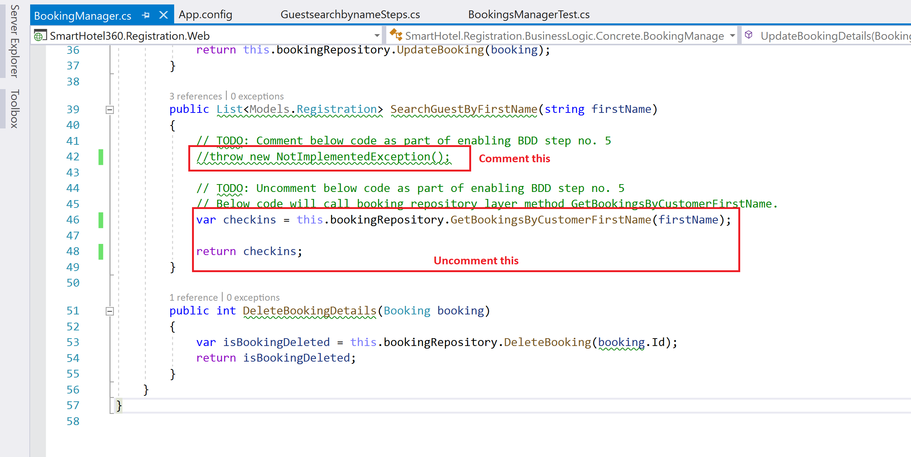

6. Open the file `SmartHotel360.Registration.Web->Repository->BookingRepository.cs.`
Follow the steps mentioned within the method **GetBookingsByCustomerFirstName** of commenting & uncommenting.
  
    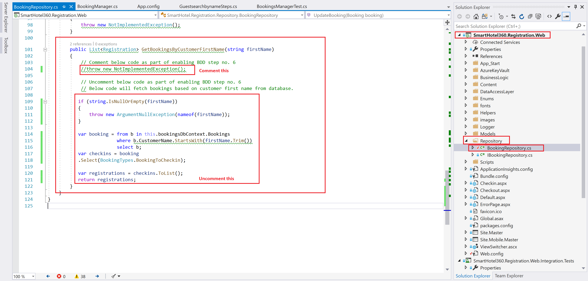
   
#### Executing BDD Test | Pass

Executing Your Second run of Test related to `SearchGuestsByFirstName` feature will pass the test as the implementation of the functionality is done.

1. To open Test Explorer Window, Go to `Test->Windows->Test Explorer`.  
    
    

2. Right Click on **SearchBasedOnTheFirstName** ->  **Run Selected Tests** to run your test. 

   

3. As the automation and application code has been implemented, the test will pass successfully.

   

### Exercise 3 : Enabling UI Test

In software engineering, graphical user interface testing is the process of testing a product's graphical user interface to ensure it meets its specifications.

1. Download and install Google chrome from this **[link](https://www.google.com/chrome/)**

      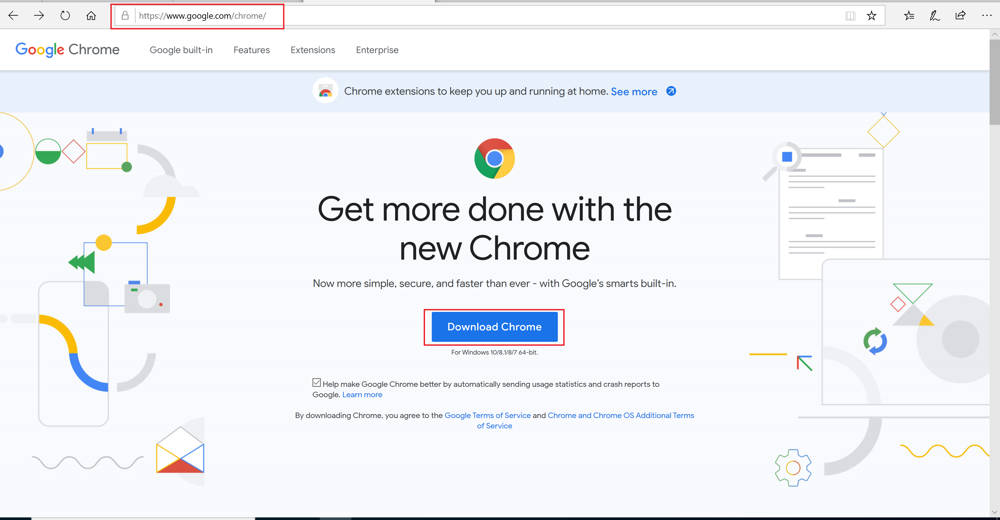

2. Go to `SmartHotel360.Registration.Web.Tests.SeleniumTests -> SearchFeatureSeleniumTests` and **DELETE** Ignore attribute from as highlighted in the image shown below. The tests will not be skipped now.
 
    

3. Go to **Web.config** in the solution explorer from `SmartHotel360.Registration.Web->Web.Config` as shown below:

   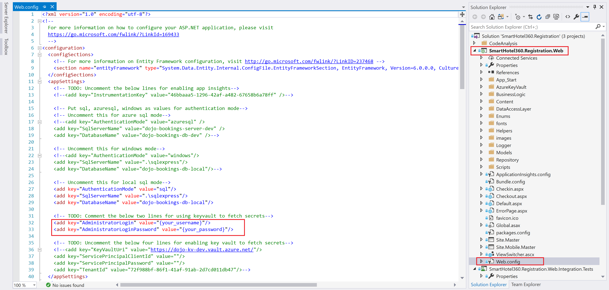

   >**NOTE**: **Step 3** asks you to put sql server credentials in config file. This is poor practice and done intentionally to highlight usage of Key Vault & CredScan later on.

4. Update the config key **AdministratorLogin** and **AdministratorLoginPassword** using the values as shown below. **Save** the file after updating the values.

   >**AdministratorLogin**: sa
  
   >**AdministratorLoginPassword**: devadmin@123
   
   

5. Go to the Top Ribbon and click on Debug-> Start Without Debugging to run `**SmartHotel360.Registration.Web**` application.
    
    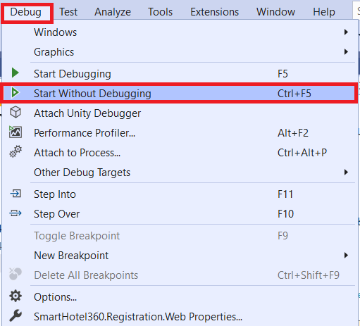

6. The Booking application will be running in your default browser as shown below.
    
    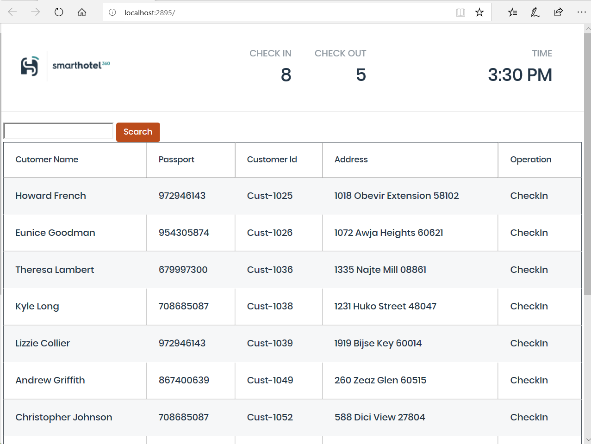

7. Right click and build the **SmartHotel360.Registration.Web.Tests** as shown below in Solution Explorer.

    

8. Open Internet Explorer browser, you will be presented with a popup warning for security settings. Selected the highlighted radio button **Use recommended security and compatibility settings** and click on **Ok**.

    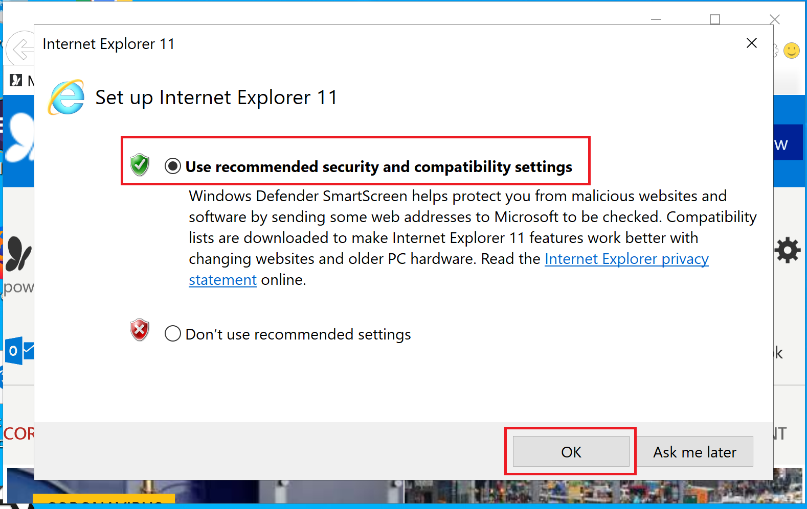

9. To open Test Explorer Window, Go to `Test->Windows->Test Explorer`.  
    
    

10. In Test Explorer, Right click **SmartHotel360.Registration.Web.Tests.SeleniumTests** -> Run Selected tests to run UI Tests as shown below:
   
    

11. The automation for UI test is described as per the below action:

    >**NOTE** Below steps will be performed automatically during Automated UI Tests run.

        1. Booking Home page in browser is opened. 
        2. Entry of Initials of customer's first name is automated in search bar.
        3. Search button is clicked.
        4. The page will return filtered list of customer/s matching with the first name.

12. Below Tests will run in Visual Studio as part of UI Tests.

     - **TheCustomerSearchIETest**: This test is performed in IE Browser.
     - **TheCustomerSearchChromeTest**: This test is performed in Chrome Browser.
     - **TheCustomerSearchFirefoxTest**: This test is performed in Firefox Browser.

13. Verify that step 12 as mentioned above is performed successfully and you see the test execution results in test explorer as per below image.

    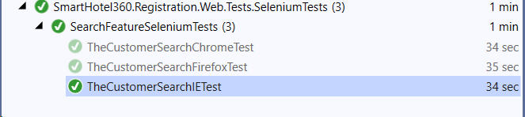

    >**NOTE** DO NOT Check-in `Web.Config` or `App.Config` files as part of raising pull request process because CredScan will break the build as it is a poor practice to checkin credentials in source code.

14. **Commit** all your changes. Enter a **logical Commit Message** that clearly descibes all the changes that you have made as shown in the image below.

  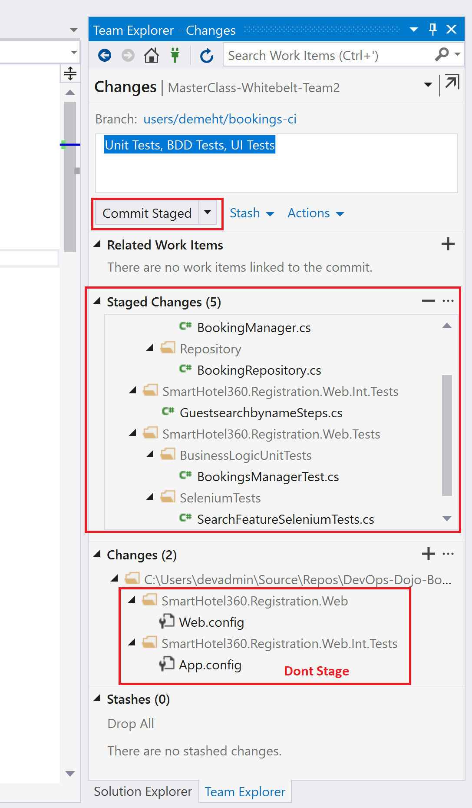

15. Click on **Commit-Staged** and check-in your staged changes/changes in your feature branch locally.

16. Switch to Branch view and push the branch.
    
      

17. Navigate to the **Azure DevOps Project** 
    >**Note:** Please contact your coach  for the link of the Azure DevOps Project.

    In the Azure DevOps Project navigate to Commits and you can see the recently committed changes reflected on the portal.

    

    

18. Now we will raise a PR. Go to Team Explorer and verify the branch you were working in.

19. Create a pull request for merge into master trunk by right clicking the branch in branch view as shown below.
	
    

20. Update the reviewers, description and title as shown below. Then click on Create as shown below:
    
    >**NOTE** Make sure that reviewer is part of the team the user is working on. There should be at least one reviewer added to the Peer-Reviewing process.
	
     

21. Students who are assigned as approver can carry out the approval process by navigating to the pull request and click on **Approve** as shown below.
        
      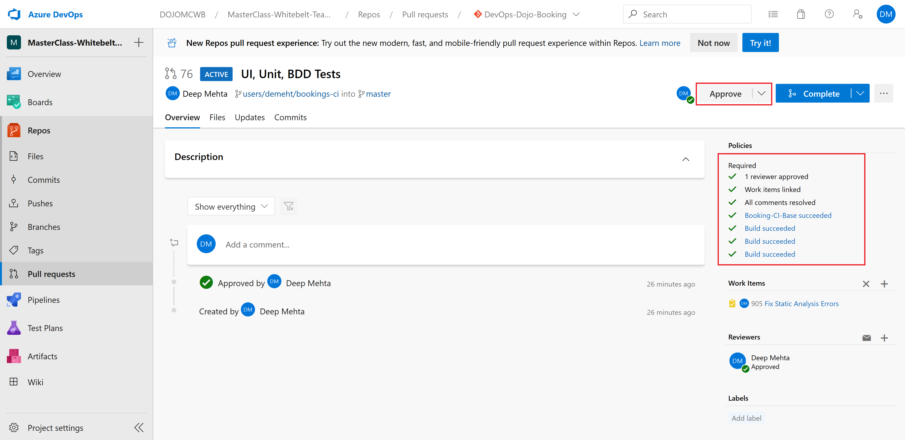

22. Once approved and all pre-reqs succeed, you can **complete the pull request** by clicking on **Complete**, ensure merge type is squash commit. This will merge your code in master trunk.

    >**NOTE** The squash commits of the merged branch are squashed into one and applied to the target branch. This shows a linear history of the commits.	
      
    

    **Successful PR completion looks like this:**

    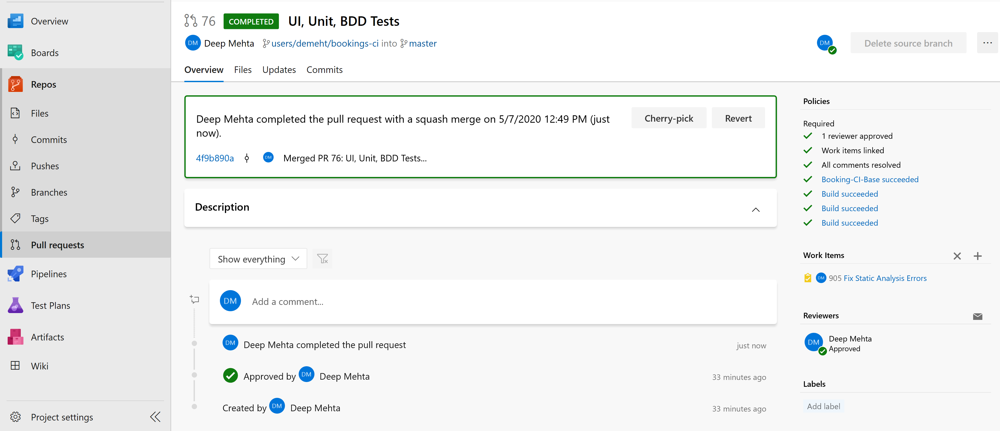