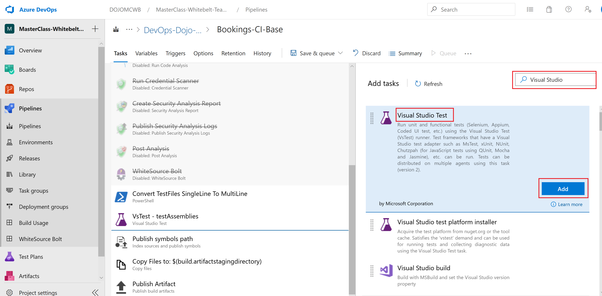
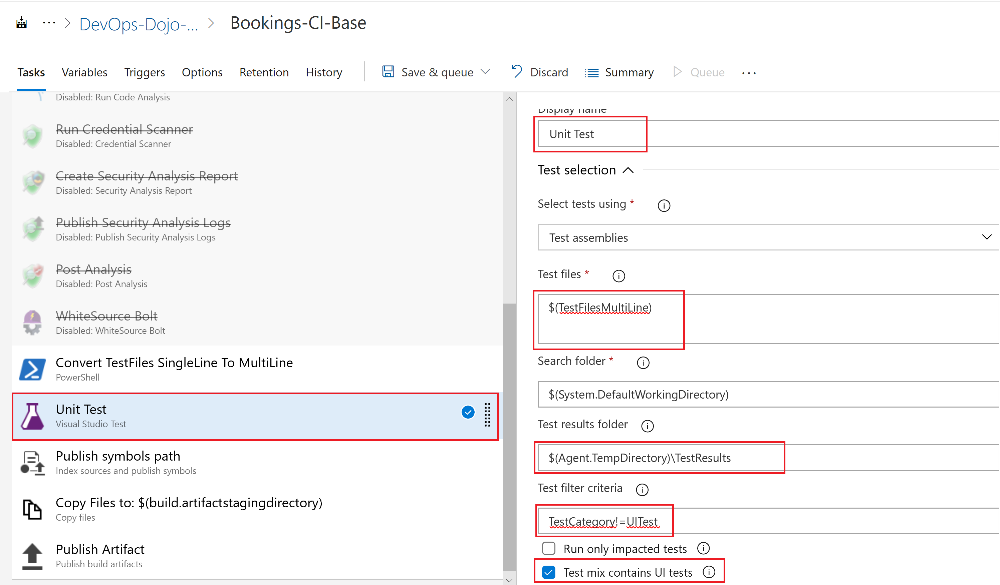
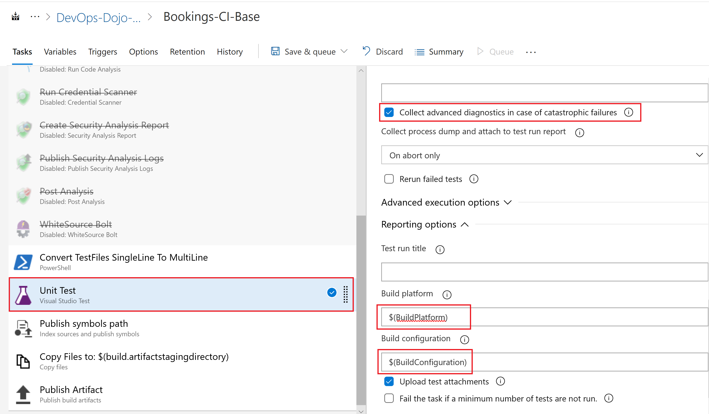
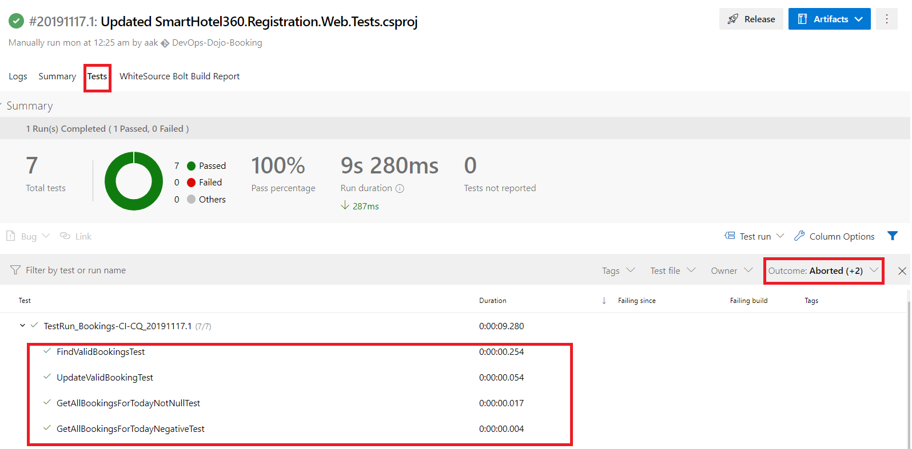

**[Home](/4-Continuous-Quality/Labs/CQ-Bookings-App-Net) | [Module 1-Code changes for CQ](/4-Continuous-Quality/Labs/CQ-Bookings-App-Net/Module-1-Code-Changes-CQ\(.Net\)) | [Module 2-Build Pipeline Changes for CQ](/4-Continuous-Quality/Labs/CQ-Bookings-App-Net/Module-2-Build-Pipeline-Changes-CQ\(.Net\))| [Module 3-Release Pipeline changes for CQ](/4-Continuous-Quality/Labs/CQ-Bookings-App-Net/Module-3-Release-Pipeline-Changes-CQ\(.Net\))  |**
[[_TOC_]]

## Module 2 : Enabling Shift Left Testing in Booking Application (Build Pipeline)

### Exercise 1 : Enabling Unit Tests in the Bookings Base Build Pipeline

In this exercise, we will **add and configure unit test** during build phase so that small parts of application can be tested easily.

1. Go to Booking Base build pipeline `Bookings-CI-Base`.

2. Click on `Edit` as highlighted in the image below.
    
      
   
3. Right click `Convert TestFiles SingleLine To MultiLine` task and click on `Enable Selected Task(s)`.
   
    

    >**NOTE** `Convert TestFiles SingleLine To MultiLine` task allows test files (.dll) in single line which is stored in pipeline variables to convert to multi-line for ease of readability. 

4. Click on **+** icon to add a task to  **Bookings-CI-Base** build pipeline. Search for `Visual Studio Test` in the search box and add the task below the powershell task `Convert TestFiles SingleLine To MultiLine`

    

5. Update the **Unit Test Task** as per the highlighted values in the image:

    |**Field**|**Value**|
     |---------|-------------|
     |**Display name**|Unit Test |
     |**Test files**|$(TestFilesMultiLine) |
     |**Test filter criteria**|TestCategory!=UITest|
     |**Build platform**|$(BuildPlatform) |
     |**Build configuration**|$(BuildConfiguration) |

    >**NOTE** As Build pipelines should not run any UI related tests, hence Test Filter Criteria is updated to skip any UI Test related category.
    
   

   

6. Click on **Save & Queue** as show below to save the Build pipeline.
    
    

   

### Exercise 2: Verify Unit Tests in Bookings Base Build Pipeline 

1. To verify Unit Tests in **Bookings Base Build pipeline**, go to **latest builds** of Booking-CI-Base and click on the highlighted build as shown below.

    

2. Go to **Tests** tab and you can see the number of Tests run and their status (Passed/Failed/ Others). You can also filter based on passed and failed tests from the Outcome filter as highlighted in below image.

   