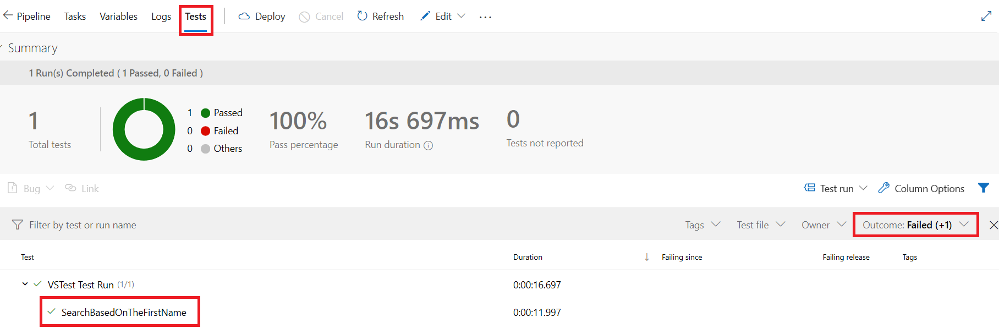
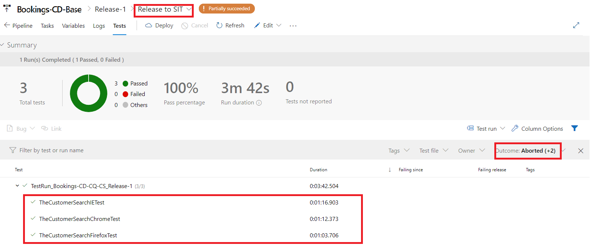

**[Home](/4-Continuous-Quality/Labs/CQ-Bookings-App-Net) | [Module 1-Code changes for CQ](/4-Continuous-Quality/Labs/CQ-Bookings-App-Net/Module-1-Code-Changes-CQ\(.Net\)) | [Module 2-Build Pipeline Changes for CQ](/4-Continuous-Quality/Labs/CQ-Bookings-App-Net/Module-2-Build-Pipeline-Changes-CQ\(.Net\))| [Module 3-Release Pipeline changes for CQ](/4-Continuous-Quality/Labs/CQ-Bookings-App-Net/Module-3-Release-Pipeline-Changes-CQ\(.Net\))  |**

[[_TOC_]]

## Module 3 : Enabling Shift left Testing in Booking Release Pipeline

### Exercise 1 : Add Functional BDD Tests in QA Stage/Environment 
In this exercise we will add and **configure Functional BDD Tests** as part of release pipeline. We already integrated this test as part of Source Code in Module 1: Exercise 2. 

1. Navigate to `Releases -> Bookings-CD-Base` and click on `edit`

    

2. Switch to `Release QA` stage under tasks view. Add an agent job by clicking on `...` and `Add an agent job`.

   

3. Update the name of agent as `Run BDD Automated Functional Tests`. Click on **+** icon next to the newly created Agent job, and add a powershell task to  **Run BDD Automated Functional Tests** agent job in Booking-CD-Base release pipeline as shown below. 
  
   

4.  Update the name of the Task "PowerShell Script" to `Update App Settings for BDD automated functional tests` and task details in the highlighted section as shown below:

    |  **Name**     | **Value**    |
    | ---------------------|----------------|
    | **Script Path**         |  $(System.DefaultWorkingDirectory)/_Bookings-CI/drop/ModernizationWithAppServiceDotNET/SmartHotel360.Registration.ARM/SpecflowIntegrationTest/UpdateAppConfigAtRunTimeWithoutKeyVault.ps1 | 
    | **Arguments**            | $(System.DefaultWorkingDirectory)/_Bookings-CI/drop/ModernizationWithAppServiceDotNET/SmartHotel360.Registration.Web.Int.Tests/bin/Release/SmartHotel360.Registration.Web.Integration.Tests.dll.config $(authenticationMode) $(sqlserver) $(databasename) $(sqlserveradmin) $(sqlserveradministratorpassword) |

      

5.  Click on **+** icon to add a `Visual Studio Test` task to  **Run BDD Automated Functional Tests** agent job in Booking-CD-Base release pipeline as shown below. Add this task below the `Update App Settings for BDD automated functional tests` powershell task.

      

6. Update the name of task Visual Studio Test to `BDD Automated Functional Tests using Specflow` and task details as highlighted in the below image.
   
   |  **Name**     | **Value**  |
   | ---------------------|----------------|
   |**Test Files**| `**\*integration.tests*.dll !**\*TestAdapter.dll !**\obj\**` |

   

7. Tick the checkbox as highlighted in the image below for the visual studio test task `BDD Automated Functional Tests using Specflow` to collect advanced diagnostics in case of failure.

   

8. Once the tasks are setup successfully, Click on **Save** as shown below.
   
    

### Exercise 2 : Add UI test in SIT Stage/Environment

1. Switch to **Release SIT** stage under tasks view. Add an agent job by clicking on `...` and `Add an agent job`.

2. Update the name of agent as `Run UI Tests`. Click on **+** icon to add a powershell task to  **Run UI Tests** agent job in Booking-CD-Base release pipeline as shown below. 
  
   

3. Update powershell task display name to `Update app config for UI Tests`, and task configurations as per the below values shown in table

     |  **Name**     | **Value**    |
    | ---------------------|----------------|
    | **Script Path**          |  $(System.DefaultWorkingDirectory)/_Bookings-CI/drop/ModernizationWithAppServiceDotNET/SmartHotel360.Registration.ARM/UITest/UpdateAppConfigSettingsUITests.ps1 | 
    | **Arguments**            | $(System.DefaultWorkingDirectory)/_Bookings-CI/drop/ModernizationWithAppServiceDotNET/SmartHotel360.Registration.Web.Tests/bin/Release/SmartHotel360.Registration.Web.Tests.dll.config "https://$(webapp).azurewebsites.net" |

   

4.  Click on **+** icon to add a `Visual Studio Test` task to  **Run UI Tests** agent job in Booking-CD-Base release pipeline as shown below. Add this task below the `Update app config for UI Tests` powershell task.

      

5. Update the Visual Studio Test task to `UI Test` and task details as highlighted in the below image.

   |  **Name**     | **Value**  |
   | ---------------------|----------------|
   |**Test filter criteria**| `TestCategory=UITest`|

   >**NOTE** As Release pipelines in SIT stage should run UI related tests, hence Test Filter Criteria is updated to run only UI Test related category.
	
   

6. Once the tasks are setup successfully, Click on **Save** as shown below.
   
    

### Exercise 3: Verify BDD Integration Tests & UI Tests in Bookings Base Release Pipeline

1. Create new Release by clicking on `Create release` button. **Deselect** the **Undeploy stages** in all environmennts and click on `Create` button as shown below.

   

   

2. To open the Release, click as shown below - 

   

3. Once dev stage is complete, Hover on `Release to QA` and click on `Approve`. This opens another tab, click on `Approve` again. This step is required as we have added pre-deployment approvals. Repeat the same for `Release SIT` stage.

   

4. Switch to Release to QA stage and go to Tests View. You can see the number of Tests run and their status (Passed/Failed/Others). You can also filter based on passed and failed tests from the Outcome filter as highlighted in below image.

   

5. Switch to `Release to SIT` stage and go to Tests View. You can see the number of Tests run and their status (Passed/Failed/Others). You can also filter based on passed and failed tests from the Outcome filter as highlighted in below image.

   