**[Home](../../Labs.md) | [Module 1-Code changes for CQ](/4-Continuous-Quality/Labs/CQ-Coupons-App-Java/Module-1-Code-Changes-CQ(Java)) | [Module 2-Build Pipeline Changes for CQ](/4-Continuous-Quality/Labs/CQ-Coupons-App-Java/Module-2-Build-Pipeline-Changes-CQ(Java))| [Module 3-Release Pipeline changes for CQ](/4-Continuous-Quality/Labs/CQ-Coupons-App-Java/Module-3-Release-Pipeline-Changes-CQ(Java))  |**

[[_TOC_]]

In this module we will enable and **run** the below **tests** :

- [Unit Tests](#exercise-1-%3A-for-enabling-unit-tests-in-the-repo): These are small, low cost, single unit coverage tests which can detect problems at the earliest stages of development. For more details related to TDD click [here](../../Reference/JavaTests.md#Introduction-to-TDD).

- [Integration Tests](#exercise-2-%3A-For-enabling-Functional-BDD-Test-in-the-repo): Functional testing is performed using the functional specification provided by the client and verifies the system against the functional requirements.
Business requirements are the inputs to functional testing.
Functional testing describes what the feature does. We have implemented feature called **`Get coupons list`** using Behavior Driven Development. For more details related to BDD click [here](../../Reference/JavaTests.md#Introduction-to-BDD).

- [UI Tests](#exercise-3-%3A-For-enabling-UI-Test): User interface testing, a testing technique used to identify the presence of defects is a product/software under test by using Graphical user interface [GUI].

### Prerequisites

This module has to be done in Eclipse IDE. (Please refer to [CI labs](/2-Continuous-Integration/Labs/CI-Coupons-App-Java/Module-1-Code-Changes-CI\(Java\)) for cloning and running the app locally).
   > **Note**: Merge master branch with latest updates in Eclipse IDE if the repo is already cloned.

1. Navigate to the **eclipse IDE** and open this file `DevOps-Dojo-Coupons/pom.xml.`

    **Add** `spring-boot-starter-test` dependency in  file (from eclipse workspace), which imports both` Spring Boot` test modules as well as JUnit, AssertJ, Hamcrest, and a number of other useful libraries.
    
    Follow the **TODOs** in `pom.xml` file. Uncomment the segment as below (delete the contents within box).
    
    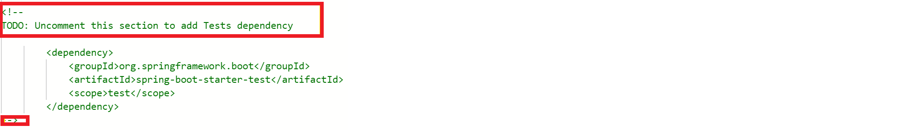  

2. **Add** the following dependencies in `DevOps-Dojo-Coupons/pom.xml` file to add `Cucumber and Gherkins` dependency for Maven. 
    **Cucumber** is a software tool used by computer programmers that supports **behavior-driven development (BDD)**.
    
    Follow the **TODOs** in `pom.xml` file. Uncomment the segment as below (delete the contents within box).

    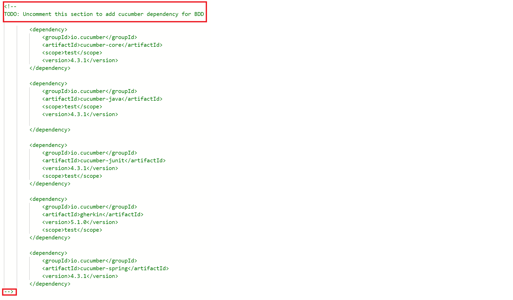

3. **Add** the following dependencies in `DevOps-Dojo-Coupons/pom.xml` file to add `selenium` dependency for Maven.
   Selenium WebDriver API enables the development of **UI tests** through Java. 
   
   Follow the [link](https://www.seleniumhq.org/) for more information.
   
   
   Follow the **TODOs** in `pom.xml` file. Uncomment the segment as below (delete the contents within box) -
 
    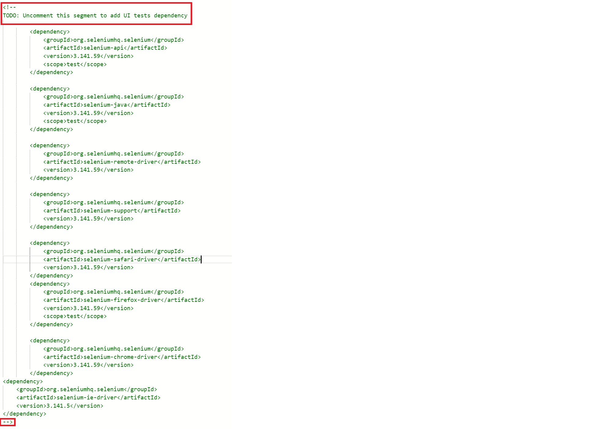  

### Exercise 1 : Enabling Unit Tests in the repo

This exercise covers **unit tests** that are already implemented using [moq framework](https://howtodoinjava.com/mockito/junit-mockito-example/).

**Pre-requisites : Please follow [pre-requisites](#Prerequisites) before following below steps.**   

1. **Unit test files** are under the folder `DevOps-Dojo-Coupons -> src -> test -> java -> com -> example -> fabrikam -> HotelCoupon -> UnitTest`
    
    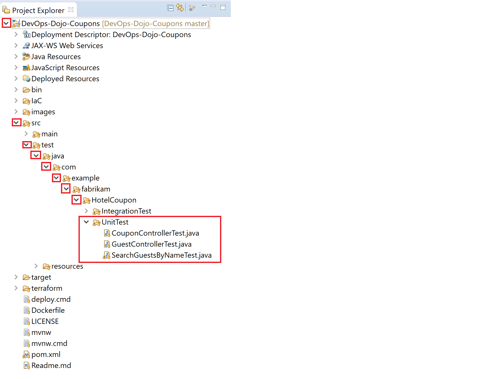

2. To **Run** each Unit test, open the file eg- GuestControllerTest.java , Click on `Run As` -> `JUnit Test`
    
    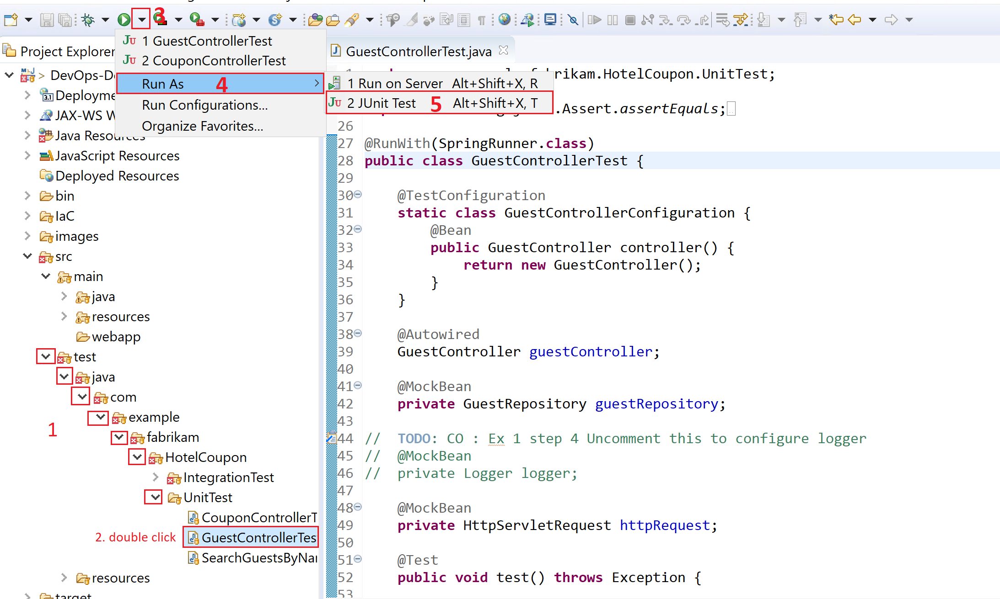

3. **Test result** will be available in the `JUnit` view. This view comes automatically once we run the test.

    
    

### Exercise 2 : For enabling Functional BDD Test in the repo

In this exercise you will be using **BDD approach** for **integration tests** or other types of tests, such as unit tests, because the steps definitions determines what the tests are doing behind the scene.

Background: `Get Coupons (index function in CouponsController)` feature is not implemented in Coupons application. Requirement definitions for `Get Coupons` feature is written in feature file using [gherkin language](https://cucumber.io/docs/gherkin/). 

Executing Your First Test `testIndex` will fail the test. Next cycle we will implement the automation code and run tests again which should pass the tests.

**Pre-requisites : Please follow [pre-requisites](#Prerequisites) before following below steps.**   

1. **BDD test** is under the folder `DevOps-Dojo-Coupons -> src -> test -> java -> com -> example -> fabrikam -> HotelCoupon -> Integration Test -> CouponControllerBDDIT.java`

2. This test **needs connection to the database to be open**. If mysql is not open, follow the [pre-requisites](/2-Continuous-Integration/Labs/Module-1-Code-Changes-CI(Java).md#prerequisites-%3A-start-mysql-server) step to run mysql server.

#### Executing BDD test | Fail

1. **Run** the file `CouponControllerBDDIT.java` as **Junit Test**. Test result will be available in the `JUnit` view. This view comes automatically once we run the test. We see that the test fails as the function is not implemented.
    
     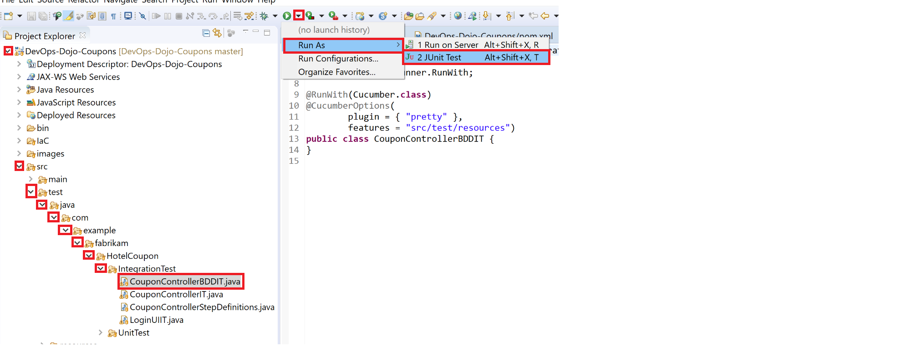

2. **Open** the file `DevOps-Dojo-Coupons -> src -> main -> java -> com -> example -> fabrikam -> HotelCoupon -> Controller -> CouponController.java` , 
**Uncomment** the lines shown in the screenshot below.  

    > **Note**: To uncomment select the lines and Press **Ctrl + /**

     

    After you uncomment the lines, you will have a view similar to the one in screenshot below

    

#### Executing BDD test | Pass

Now that the feature is implemented, it should pass all the test cases. **Run BDD test** again to verify.

1. **Run** the file `CouponControllerBDDIT.java` as **Junit Test**. Test result will be available in the `JUnit` view. This view comes automatically once we run the test. The test passes.
    
     

### Exercise 3 : For enabling UI Test

In software engineering, graphical user interface testing is the process of testing a product's graphical user interface to ensure it meets its specifications.

**Pre-requisites : Please follow [pre-requisites](#Prerequisites) before following below steps.**   

1. Download and install Google chrome from this **[link](https://www.google.com/chrome/)**

      

2. **Open** `Internet Explorer` and  **select**` recommended settings`.

    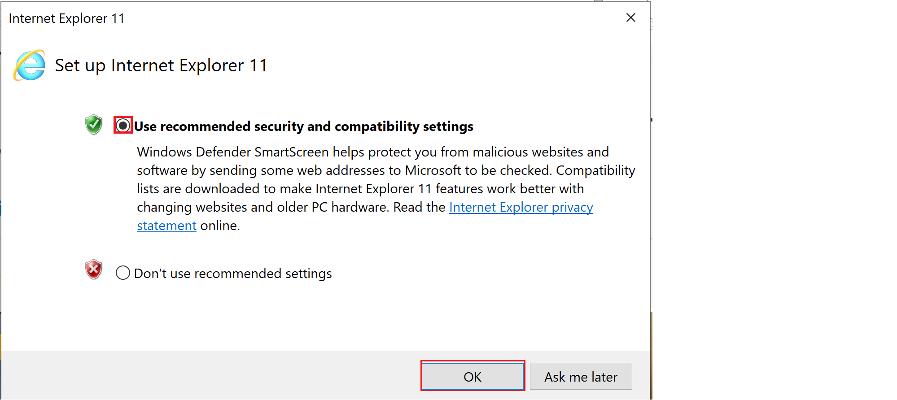  

3. Navigate to **eclipse IDE** open `DevOps-Dojo-Coupons/src/main/resources/application.properties` file. **Uncomment** the `app.url line `as shown in screenshot below. This url will be read by UI test while running.
    
    Uncomment the line as below by removing # from the line.

    

4. **Run** the app with goal `clean package spring-boot:run` so that app is running on the port 8080. This way, **when we start UI test**, the **app is running on localhost**.

    

    

5. **Run** the file `LoginUIIT` as Junit Test. Test result will be available in the `JUnit` view. This view comes automatically once we run the test. 

    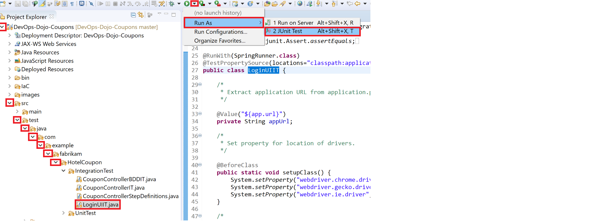

> **Troubleshooting**: If the tests fail to run, and the error is with chrome version, download the latest exe of chrome from this **[link](https://chromedriver.chromium.org/downloads)**, and replace the exe file in this location: `src/test/resources/binaries/chromedriver.exe`

6. **Push the branch** following steps 
**Right click** on the `Branches -> Switch To -> New branch`.

    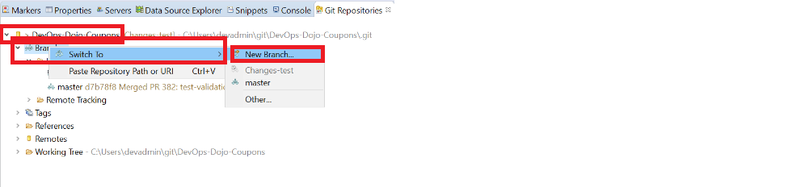

7. Enter branch name and click on `Finish` button. 

    >**Note:** Branch name should be in format `users/<username>/<branch-name>` & branch-name must be logical and must clearly state the features implemented

	

    > **Important**- Make sure that you **DO NOT** checkin any credentials into the branch, this can lead to secret leaks and in later stages failure of credscan task.

8. **Right click** on your git repo -> `Commit`. The changed files will now appear in unstaged changes section.
**Drag and drop** the files with changes from `Unstaged changes` to `Staged changes` pane.

    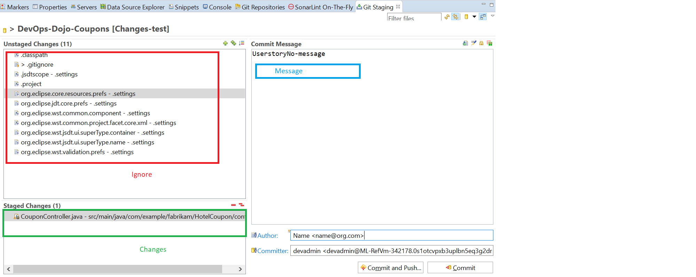.

9. Enter a **logical Commit Message** clearly explaning all the changes you have made in the branch. Select `Commit and push...` to commit and push the branch. 

    >**Note:** If clicked on `Commit`, manually push the branch.

    >**NOTE**: Avoid Pushing any files which you haven't edited and .extension files.

10. **Click** on the **Next** button.

    

11. On the **Push Confirmation screen**, enter the `Personal Access Token`. **Click** on **Login** Button.

    >**Note**: The username will be populated by default and you will not be able to edit it. Use the same Personal Access Token that was generated in pre-requisites

    

12. **Click** on the **Finish** button.

    

13. The following screen is displayed. Click on the `Close` button.

    

14. Navigate to the **Azure DevOps portal** 
    >**Note:** Please contact your coach  for the link of the Azure DevOps portal.

    In the Azure DevOps portal navigate to Commits and you can see the recently committed changes reflected on the portal.

    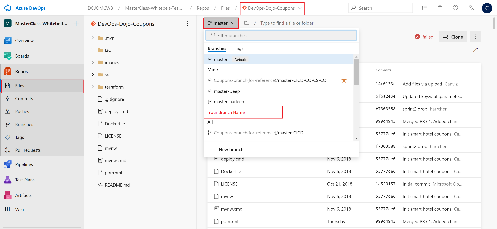

    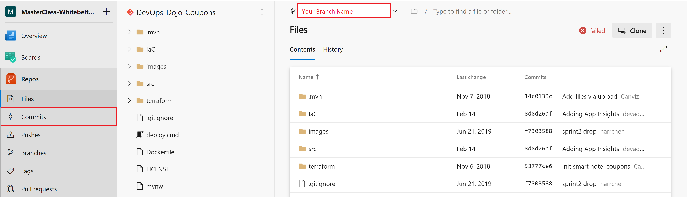

    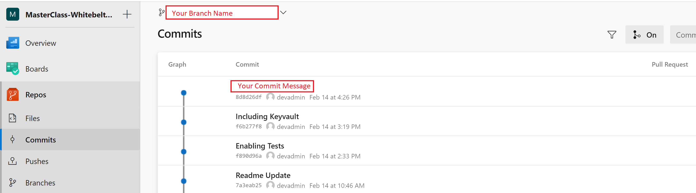

15. Raise a PR following the steps.

    Go to Azure DevOps project , and navigate to `Repos -> Branches`. 

    > **Fallback scenario CI lab**:  Whether it was not possibile to conduct the changes into Eclipse, use the reference branch *Coupons-branch(for-reference)/master-CICD* for the pull request.

16. Hover on the branch which needs pull request and click on `...` button. Select `New pull request`to trigger a PR.

    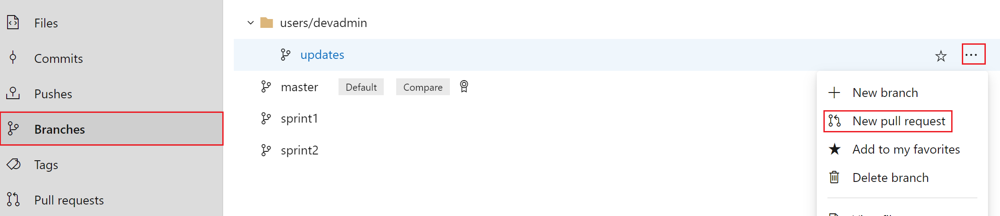

17. **Update** the `reviewers, work items, description and title` as shown below. Then click on Create as shown below:
    
    >**NOTE** Make sure that reviewer should be part of the team the user is working on. There should be atleast one reviewer added to the Peer-Reviewing process.

    

18. Students who are assigned as approver can carry out the approval process by navigating to the pull request and click on **Approve** as shown below.
        
      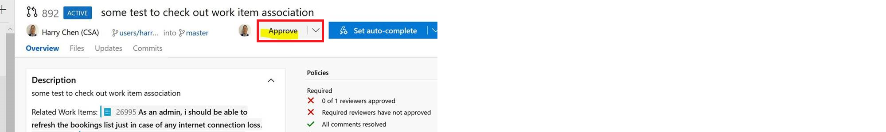

19. Once approved and all pre-reqs succeed, you can complete the pull request by clicking on `Complete`. 

    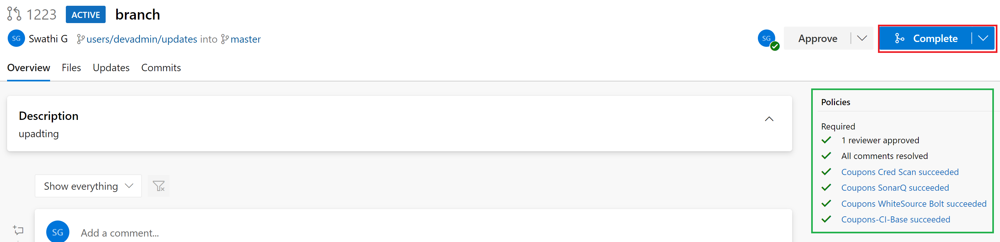

20. Select `Sqash commit` in **merge type** and Complete merge. This will merge your code in master trunk.
 
    >**NOTE** The squash commits of the merged branch are squashed into one and applied to the target branch. This shows a linear history of the commits.	

    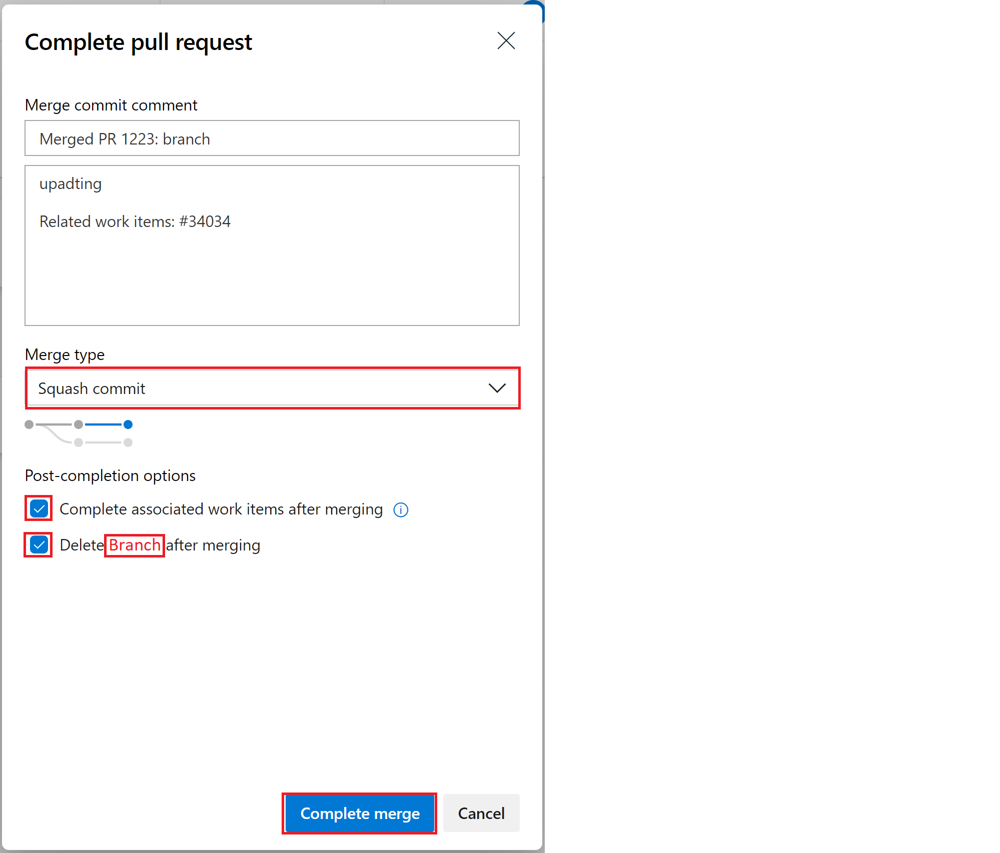