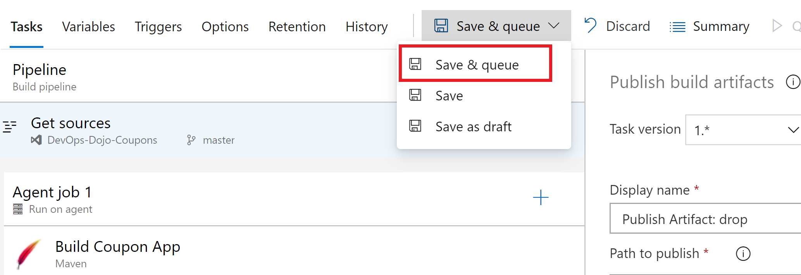

**[Home](../../Labs.md) | [Module 1-Code changes for CQ](/4-Continuous-Quality/Labs/Module-1-Code-Changes-CQ(Java)) | [Module 2-Build Pipeline Changes for CQ](/4-Continuous-Quality/Labs/Module-2-Build-Pipeline-Changes-CQ(Java))| [Module 3-Release Pipeline changes for CQ](/4-Continuous-Quality/Labs/Module-3-Release-Pipeline-Changes-CQ(Java))  |**

[[_TOC_]]

## Exercise 1 : Build pipeline changes to run java tests in azure pipeline

In this module we will **enable unit tests** in Build pipeline and display results.

1. Navigate to `Pipelines -> Coupons-CI-Base` 
    
    

2. Edit `Coupons-CI-Base`

      

2. **Select** the `Maven task`. 

    Change the **Goal(s)** in Maven task to `clean package`. [Package](/3-Continuous-Delivery/CICD-Design(Java).md#Goals) is used to take the compiled code and package it in its distributable format, such as a WAR. This WAR file is used in Release pipeline for deployment. package also runs all unit tests in the applciation and store results in surefire-reports folder.

3. **Check** the `Publish to Azure Pipelines` box under Junit Test Results.

4. Add the **test results** path file - `**/surefire-reports/TEST-*.xml`

    

5. **Save and queue** the pipeline.

   

6. **Check** for **test results** after build is complete.

    
