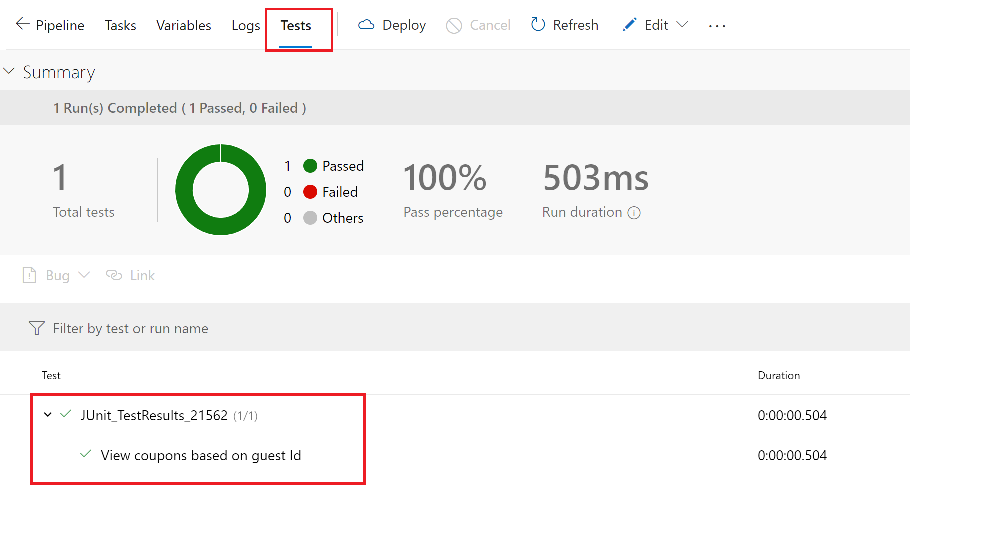
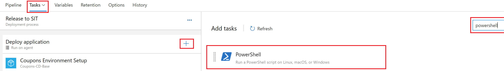
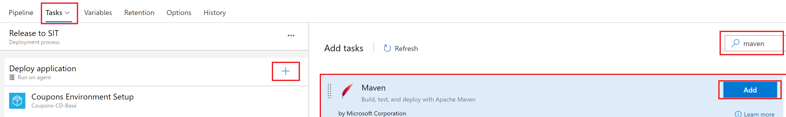
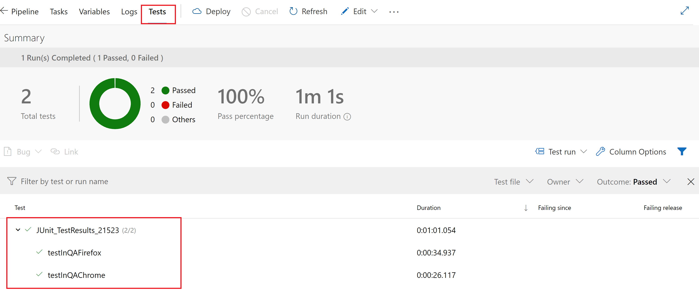
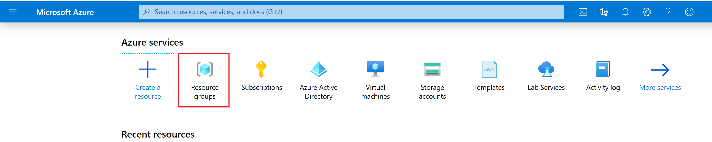
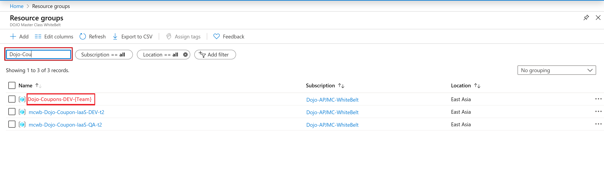

**[Home](../../Labs.md) | [Module 1-Code changes for CQ](/4-Continuous-Quality/Labs/CQ-Coupons-App-Java/Module-1-Code-Changes-CQ(Java)) | [Module 2-Build Pipeline Changes for CQ](/4-Continuous-Quality/Labs/CQ-Coupons-App-Java/Module-2-Build-Pipeline-Changes-CQ(Java))| [Module 3-Release Pipeline changes for CQ](/4-Continuous-Quality/Labs/CQ-Coupons-App-Java/Module-3-Release-Pipeline-Changes-CQ(Java))  |**

[[_TOC_]]

In this module we will **enable BDD tests** in `QA environment` and **UI tests** in `SIT environment`.

>**Note:** All the changes needs to be done in release pipeline - Coupons-CD-Base

### Exercise 1 : Add BDD in QA Stage 

In this exercise we will **add and configure** `Functional BDD Tests` as part of release pipeline. We already integrated this test as part of Source Code in Module 1: Exercise 2. These changes needs to be done in **Release to QA** stage. 

1.  Navigate to `Releases -> Coupons-CD-Base` and **click** on `edit`

    

1. **Add** a `powershell task`. Drag till after the task `Deployment Application to tomcat server`

        

2. Change Display name to `Update Test Settings`. 

    Choose the script path of `$(System.DefaultWorkingDirectory)/_Coupons-CI/drop/IaC/scripts/UpdateVariablesAtRunTime.ps1` from Drop. This powershell task **updates** the `application.properties` file to **read the required values** as per newly created QA Stage.
    
    Add the following in arguments -
	```
	-configPath $(System.DefaultWorkingDirectory)/_Coupons-CI/drop/src/main/resources/application.properties 
	-mysqlUserName $(databaseusername) 
	-mysqlPassword $(databasepassword)  
	-sourceUrl "jdbc:mysql://$(datapublicip):3306/hotel_coupon?verifyServerCertificate=false&useSSL=false&requireSSL=false" 
	-appUrl "http://$(apppublicip):8080"
	``` 
    
    

3. **Add** a task for `Maven`. This task will **run the BDD test** and populate test result in pipeline. Update the `Display name` of task to BDD test.

    

4. Set goals to `verify -Dit.test=CouponControllerBDDIT verify`. 
   
   ><span style="color: blue; background: lemonchiffon">**NOTE**: Verify is used to run any checks on results of integration tests to ensure quality criteria are met.</span>
   >
    
5. **Change** the **pom file path** from the drop `$(System.DefaultWorkingDirectory)/_Coupons-CI/drop/pom.xml`

6. **Check** the `Publish to Azure Pipelines box` under Junit Test Results.

7. Add the test results path file - `**/failsafe-reports/TEST-com.example.fabrikam.HotelCoupon.IntegrationTest.CouponControllerBDDIT.xml`
	
    ><span style="color: blue; background: lemonchiffon">**NOTE**: Failsafe reports contains the test reports for all tests other than Unit tests.</span>
    
    

2. **Save** the pipeline by clicking Save. **Trigger** a release by clicking on `Create release` button. 

   

   


2. To open the Release, click Release name as  shown below - 

   

3. Once dev stage is complete, Hover on `Release to QA` and click on `Approve`. This opens another tab, click on `Approve` again. 

    >**Note:** This step is required as we have added pre-deployment approvals.

   


9. Check for test results in test tab of the pipeline.

     

### Exercise 2 : Add UI test in SIT Stage

In this exercise we will **add and configure** `Automated UI Tests` as part of release pipeline. We already integrated this test as part of Source Code in Module 1: Exercise 3. 

>These changes needs to be done in **Release to SIT** stage.

1. **Add** a **powershell task**. Drag till after the task `Deployment Application to tomcat server`.

        

2. Change **Display name** to `Update test settings`. 

    Choose the **script path** of `$(System.DefaultWorkingDirectory)/_Coupons-CI/drop/IaC/scripts/UpdateVariablesAtRunTime.ps1` from Drop. This powershell task **updates** the `application.properties` file to **read the required values** as per newly created SIT Stage.
     
    Add the following in arguments -
	```
	-configPath $(System.DefaultWorkingDirectory)/_Coupons-CI/drop/src/main/resources/application.properties 
	-mysqlUserName $(databaseusername) 
	-mysqlPassword $(databasepassword)  
	-sourceUrl "jdbc:mysql://$(datapublicip):3306/hotel_coupon?verifyServerCertificate=false&useSSL=false&requireSSL=false" 
	-appUrl "http://$(apppublicip):8080"
	``` 
    
    

3. **Add** a **task** for `Maven`. This task will **run** the `BDD test` and populate test result in pipeline. **Update** the `Display name` of task to UI test.
   
    
	
4. **Set goals** to `verify -Dit.test=LoginUIIT#testInQA* verify`
    
    ><span style="color: blue; background: lemonchiffon">**NOTE**: Verify is used to run any checks on results of integration tests to ensure quality criteria are met.</span>
	
5. **Change** the **pom file path** from the drop `$(System.DefaultWorkingDirectory)/_Coupons-CI/drop/pom.xml`

6. **Check** the `Publish to Azure Pipelines` box under JUnit Test Results.

7. **Add** the test results path file - `**/failsafe-reports/TEST-com.example.fabrikam.HotelCoupon.IntegrationTest.LoginUIIT.xml`
   
     ><span style="color: blue; background: lemonchiffon">**NOTE**: Failsafe reports contains the test reports for all tests other than Unit tests.</span>
    
    

2. **Save** the pipeline by clicking Save. **Trigger** a release by clicking on `Create release` button. 

   

   


2. To open the Release, click Release name as  shown below - 

   

3. Once dev stage is complete, Hover on `Release to QA` and click on `Approve`. This opens another tab, click on `Approve` again. 

    >**Note:** This step is required as we have added pre-deployment approvals.

   


9. Check for test results in test tab of the pipeline.
    
     

### Exercise 3 : Check updated Coupons app

1. Go to Azure Portal. 

    Navigate to resource group `Dojo-Coupons-DEV-{Team1/2}` and **click** on app VM `(cpndev{team#}-app)` -> **Copy** the **Public IP address**.

    

    

    

2. Type `Public IP address:8080` in browser to use Coupons app.
**Login** with following credentials:
    >Username = **me@smarthotel360.com**

    >Password = **1234** 

    
