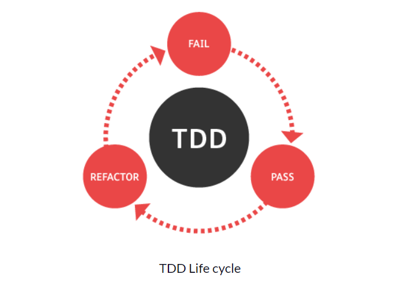
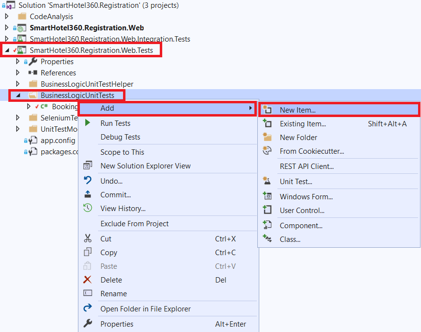
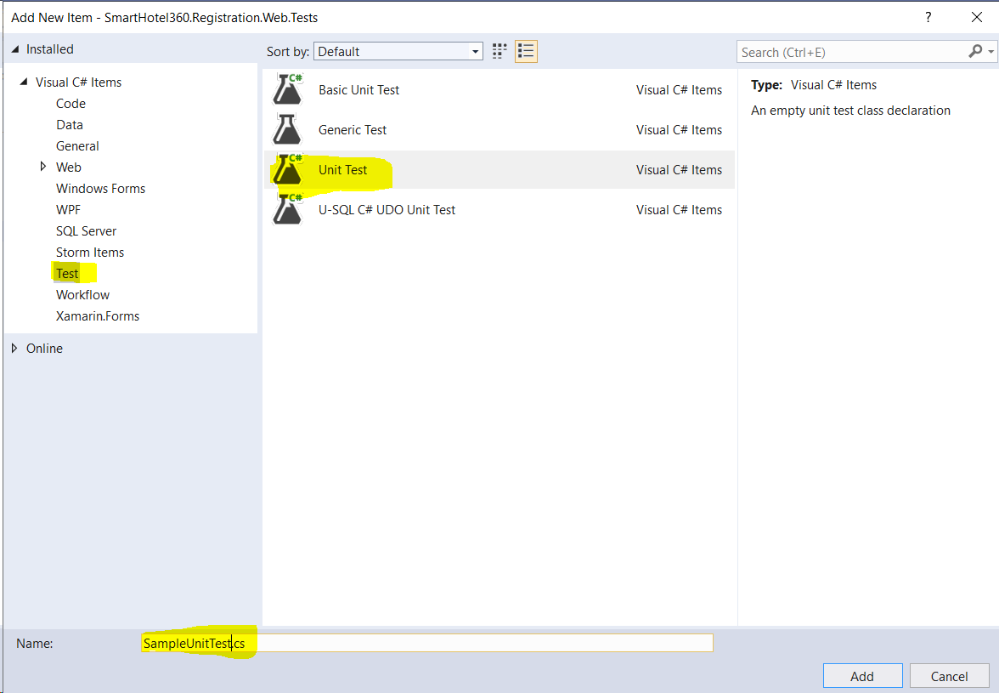
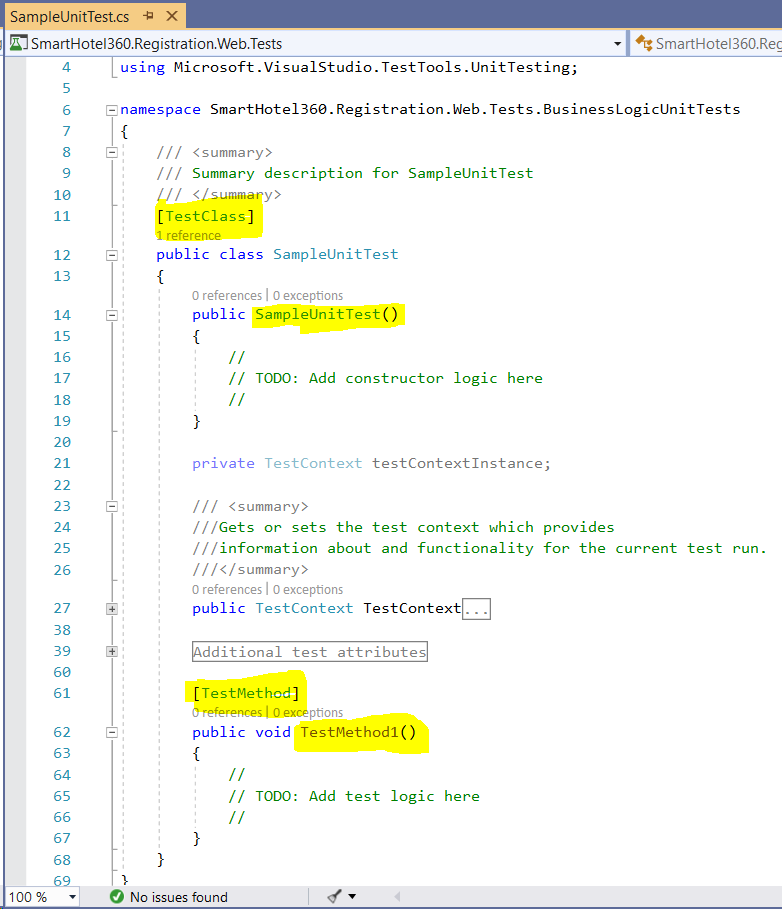
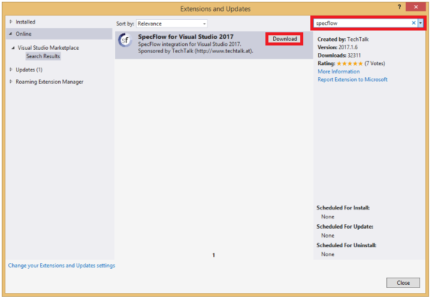
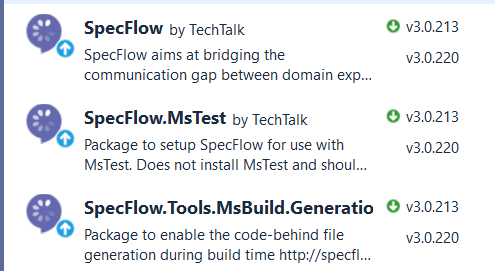

# Driven Development

[[_TOC_]]

## Introduction to TDD

TDD stands for **Test Driven Development**, and it’s a design process in software development. It relies on the repetition of a very short development cycle, and the requirements are turned into very specific test cases.

### Steps in the TDD process

1. Write a unit test that fails.

2. Write enough code to make the test pass - at this step we don’t care about good code.

3. Refactor your code from the previous step.

### TDD Life cycle

<!--  -->
<p align="center">
  
</p>

### What are the benefits of this approach?

- First of all, you get a **better understanding of the actual code** before you write it. This is one of the greatest benefits of TDD. When you write the test cases first, you think more clearly about the system requirements and more critically about the corner cases.

- Also, when talking about dependencies, it’s important to mention that working with TDD lets you focus on the logic of your classes. This way you keep all the **dependencies outside of your classes**. It’s also important to mention that your code will run more safely since the logic will not have to handle difference dependencies such as database connections, file systems, and so on.

- It’s also a **safer way to refactor the code**. When writing TDD there are tests for a certain piece of logic. When you refactor the code you might break something, but with this approach you know the tests will have your back.

- When you use TDD, you also have a faster way to **understand what the code does**. When you start working on a piece of code that you are unfamiliar with, you can read the test cases of that piece of code and understand its purpose. Those **tests are also the documentation for your code**.

- And finally, you can **focus on building the smaller components** in the best way and avoid the headache of the big picture. So how does this help? You’ll write one failing test, and focus solely on that to get it passing. It forces you to think about smaller chunks of functionality at a time rather than the application as a whole. Then you can incrementally build on a passing test, rather than trying to tackle the bigger picture from the get-go, which will probably result in more bugs.

### Follow the below link to get started with TDD

**[TDD Quick Start Guide](https://docs.microsoft.com/en-us/visualstudio/test/quick-start-test-driven-development-with-test-explorer?view=vs-2019)**

### Create Unit test in VS 2019

1. Right Click the **Unit Test Project** or **Unit Test Folder**, in our case it would be **SmartHotel360.Registration.Web.Tests**. Click on Add New Item.

    <p align="left">
      
    </p>

2. Choose **Test** under Visual C# Items-> **Unit Test** as highlighted in the image. Give some meaningful name to the test file.

    <!--  -->
    <p align="left">
      
    </p>

3. Sample Unit Test would be created as shown below

    <!--  -->
    <p align="left">
      
    </p>

## Introduction to BDD

### What is BDD?

Behavioral Driven Development (BDD) is a software development approach that has evolved from TDD (Test Driven Development). It differs by being written in a **shared language, which improves communication between tech and non-tech teams and stakeholders**. In both development approaches, tests are written ahead of the code, but in BDD, tests are more user-focused and based on the system’s behavior.

### Getting started with BDD

This guide contains the following sections:

1. Installation and Setup
2. Adding a Feature File
3. Executing Your First Test
4. Implement the automation code and run tests again

> Instead of SpecFlow+ Runner, you can also use other test engines, like MsTest, xUnit, or NUnit. These packages are installed in exactly the same manner as SpecFlow+ Runner. However to follow all the steps in this guide, you need to install SpecFlow+ Runner. The evaluation version of SpecFlow+ Runner delays the execution of your tests by a number of seconds each time. You can request a [https://specflow.org/plus/request-trial/](demo license key) to remove this restriction (please include your name and company name, as this information is included in the license).

#### Installation and Setup

Installing SpecFlow consists of two steps:

    1. Install the IDE integration
    
    2. Set up your Visual Studio project to work with SpecFlow

#### Installing the IDE Integration Packages

The easiest way to install the SpecFlow Visual Studio extension method is to select **Tools | Extensions** and Updates from the menu in Visual Studio, switch to the Online search on the left and enter “SpecFlow” in the search field at the top right.

    

    <p align="left">
      
    </p>

Click on the **Download** button to install the extension.

#### Setting Up your SpecFlow Project

SpecFlow tests are usually placed into one or more separate projects in your solution, and these projects are referred to as a “specification project” below. The easiest and most convenient way to set up these projects is to use our SpecFlow NuGet package or one of the specific helper packages, like SpecRun.SpecFlow or SpecFlow.NUnit.

To set up your specification project:

1. Add an “**MSTest Test Project (.NET Core/ Framework)**” to your solution (e.g. “MyProject.Specs”).
    >Note: Adding a “Unit Test Project” simplifies the setup, as we will be using the .NET Core framework for this project. For a Full Framework project, select “Unit Test Project (.NET Framework)” instead.

2. Remove the UnitTest1.cs file, as it is not required.
3. Right-click on your solution (e.g. “MyProject.Specs”) and select **Manage NuGet Packages for Solution**.
4. Install the following packages (use the search field to filter the search results): 
	- SpecFlow
	- SpecFlow.Tools.MsBuild.Generation
	- SpecRun.SpecFlow
5. **Microsoft .NET Test SDK 15** is also required. If you have not installed this package already, please install it as well.

In order to run your tests, SpecFlow needs to generate so-called “code-behind” files. The SpecFlow.Tools.MsBuild.Generation NuGet package is responsible for generating these files whenever you build your solution.

Apart from this, make sure you have the below nuget packages installed in your specs.tests project.
>Note: Package for Specflow.MsTest is only for MSTest framework using SpecFlow.

    <p align="left">
      
    </p>

#### Adding a Feature File

1. Right-click on your specifications project and select `Add -> New Item` from the popup menu.

2. Select SpecFlow Feature File (restrict the entries by entering “SpecFlow” in the search field), give it a meaningful name (e.g. “Calculator.feature”) and click on **Add**.
    >Note: Do not choose one of the feature files with a language in the name, as these files do not contain the skeleton code we will be using.

3. The feature file is added to your specification project. It includes a default scenario for adding two numbers. Update the feature file as per below code:

```
Feature: guestsearchbyname

Scenario: Search based on the first name
	**Given** a search bar is at the bookings app home page
	**When** the user enters "jus" as the first name into the search bar
	**Then** guest names starting with "jus" are shown on the home page
```

>Note: Gherkin language is used for above feature file.Gherkin is a Business Readable, Domain Specific Language created especially for behavior descriptions. It gives you the ability to remove logic details from behavior tests. Gherkin serves two purposes: serving as your project's documentation and automated tests.

#### Generating Step Definitions

In order to test our scenario, we need to create step definitions that bind the statements in the test scenario to the application code. SpecFlow can automatically generate a skeleton for the automation code that you can then extend as necessary:

1. Right-click on your feature file in the code editor and select Generate Step Definitions from the popup menu. A dialogue is displayed.

2. Enter a name for the class, e.g. “GuestSearchbyNameSteps”.

3. Click on Generate and save the file. A new skeleton class is added to your project with steps for each of the steps in the scenario:

```
[Binding]
    public class GuestsearchbynameSteps
    {
        IBookingManager bookingManager = new BookingManager(new BookingRepository());
        private List<SmartHotel.Registration.DAL.Registration> firstNameSearchResult;

        [Given(@"a search bar is at the bookings app home page")]
        public void GivenASearchBarIsAtTheBookingsAppHomePage()
        {
            Console.WriteLine("Skip this!");
        }
        
        [When(@"the user enters ""(.*)"" as the first name into the search bar")]
        public void WhenTheUserEntersAsTheFirstNameIntoTheSearchBar(string firstName)
        {
            firstNameSearchResult = bookingManager.SearchGuestByFirstName(firstName);
        }
        
        [Then(@"guest names starting with ""(.*)"" are shown on the home page")]
        public void ThenGuestNamesStartingWithAreShownOnTheHomePage(string expectedFirstNameResult)
        {
            Assert.IsNotNull(firstNameSearchResult);
            Assert.AreEqual(2, firstNameSearchResult.Count);
            foreach(var result in firstNameSearchResult)
            {
                Assert.IsTrue(result.CustomerName.ToLowerInvariant().StartsWith(expectedFirstNameResult));
            }           
        }
    }
```

#### Feature Steps

1. **Given**
The purpose of Given steps is to put the system in a known state before the user (or external system) starts interacting with the system (in the When steps). Avoid talking about user interaction in givens. 

2. **When**
The purpose of When steps is to describe the key action the user performs.

3. **Then**
The purpose of Then steps is to observe outcomes. The observations should be related to the business value/benefit in your feature description. The observations should inspect the output of the system (a report, user interface, message, command output).