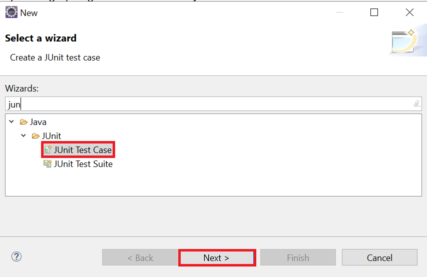
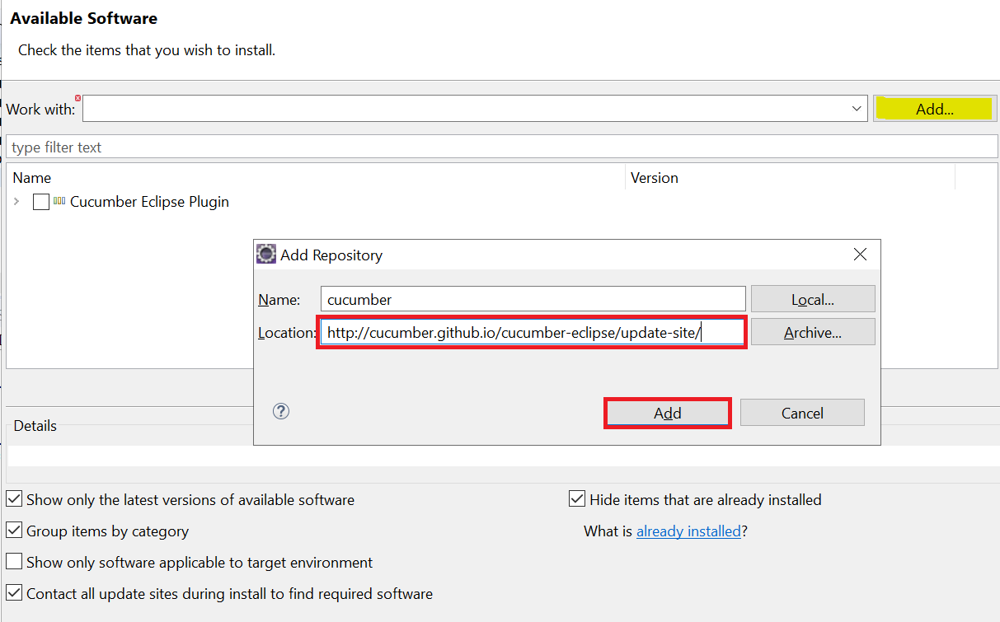
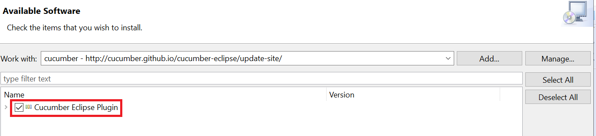
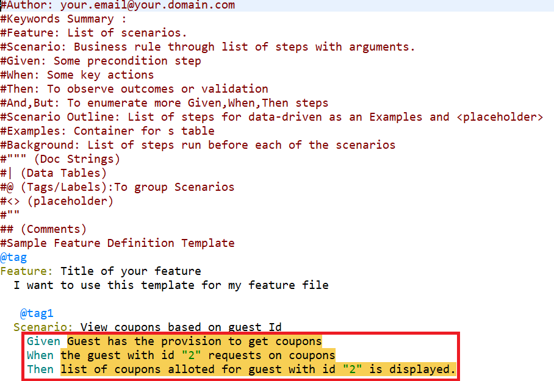
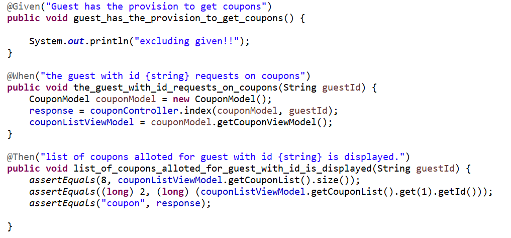
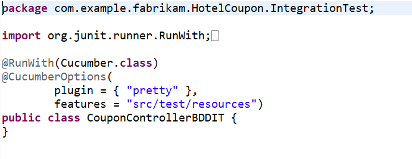

[[_TOC_]]

# Introduction to TDD

TDD stands for **Test Driven Development**, and it’s a design process in software development. It relies on the repetition of a very short development cycle, and the requirements are turned into very specific test cases.

## Steps in the TDD process

1. Write a unit test that fails.
	
2. Write enough code to make the test pass — at this step we don’t care about good code.

3. Refactor your code from the previous step.

## TDD Life cycle

## What are the benefits of this approach?

- First of all, you get a **better understanding of the actual code** before you write it. This is one of the greatest benefits of TDD. When you write the test cases first, you think more clearly about the system requirements and more critically about the corner cases.

- Also, when talking about dependencies, it’s important to mention that working with TDD lets you focus on the logic of your classes. This way you keep all the **dependencies outside of your classes**. It’s also important to mention that your code will run more safely since the logic will not have to handle difference dependencies such as database connections, file systems, and so on.

- It’s also a **safer way to refactor the code**. When writing TDD there are tests for a certain piece of logic. When you refactor the code you might break something, but with this approach you know the tests will have your back.

- When you use TDD, you also have a faster way to **understand what the code does**. When you start working on a piece of code that you are unfamiliar with, you can read the test cases of that piece of code and understand its purpose. Those **tests are also the documentation for your code**.

- And finally, you can **focus on building the smaller components** in the best way and avoid the headache of the big picture. So how does this help? You’ll write one failing test, and focus solely on that to get it passing. It forces you to think about smaller chunks of functionality at a time rather than the application as a whole. Then you can incrementally build on a passing test, rather than trying to tackle the bigger picture from the get-go, which will probably result in more bugs.

## Creating Unit Tests

1. Right click on the file you need to write unit test for -> `New -> Other -> JUnit -> JUnit Test Case`

    

2. Select JUnit 4 Test and click Finish.

    

3. A new test file will be created under `src\test\java\com\example\fabrikam\HotelCoupon\controller`. 

# Introduction to BDD

## What is BDD?
Behavioral Driven Development (BDD) is a software development approach that has evolved from TDD (Test Driven Development). It differs by being **written in a shared language**, which **improves communication between tech and non-tech teams and stakeholders**. In both development approaches, tests are written ahead of the code, but in BDD, tests are more user-focused and based on the system’s behavior.

## Getting started with BDD

This guide contains the following sections:

1. Installation and Setup
2. Adding a Feature File
3. Executing Your First Test
4. Implement the automation code and run tests again

# BDD in Java using Cucumber tool

1. This will explain how to set up the environment to run BDD.
2. How  to create a sample functional test using BDD approach.

## Install Cucumber for Eclipse

1. Navigate to `Eclipse -> Help -> Install new software`
2. Select ADD and type `http://cucumber.github.io/cucumber-eclipse/update-site/` in location.
   
    

3. Select the option - `Cucumber Eclipse Plugin` and proceed to install cucumber.
    
    

4. **Restart Eclispe** to complete the installation.

## Create a BDD sample

### Create a Feature file

1. Select `New -> File` and name the file with extension 
`.feature`

2. Provide the suitable Feature, Scenario with Given , When and Then statements.

    

### Create Step Definitions File

1. Select `New -> class`

2. Add the **methods** to run Given, When and Then statements.

    

### Create a Runner Class

1. Select `New -> class`

2. Add `@RunWith(Cucumber.class)` on the class to run this with Cucumber class.

3. Add **Features tag** to specify the location of feature file.

4. Add **Glue tag** to specify the location of Step Definitions file. If both the runner class and 

    

5. Run the file as JUnit to see results.