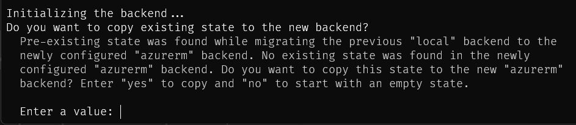
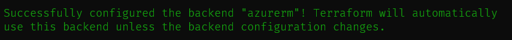
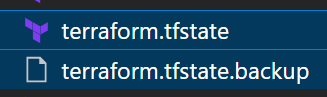

# Getting started

## Terraform state file

When starting from scratch with just some **terraform** code, terraform will store its state locally in the file named `terraform.tfstate`. This file is located at the directory location where the `root module` is (most of the time where the `main.tf` is).

This is a good way to start, but as soon as a repository and some scaling are involved, it presents limitations:

- How can someone work across machines if the state is bound to 1 specific machine?
- How can others work on the infrastructure deployed and managed by this terraform as the state is located on someone's machine?
- The terraform can only be run from the machine/user who deployed it initially. Not practical for a Pipeline, not protected against deletion (or where is it?), not a secure store - and a tf state file contains sensitive data.

That is because:

- Without a state, terraform assumes none of the described resources exist
- It will try to create them new, and fail as they probably already exist
- Additionally, no infrastructure drift can be detected without a state of what they were at last deployment.

To solve this little chicken and egg issue (if one wants everything to be under terraform control), I use this technic:

## Create Azure remote backend storage for terraform state locally

1. Create a simple terraform code (here in `main.tf`) to create the _terraform remote backend_:
  
    - a resource group
    - a storage account
    - 1/n container(s) in the storage account.

Important notes:

> - This is an opinionated implementation where:
>
>   - Names are derived from the variables: `codes`, `base_name` and `suffix` - this behavior can be changed in `main.tf`
>   - All variables come with a `default` value - they can be overridden by setting values in `variables_values.auto.tfvars`
>   - The `"RefreshedOn"` tag is always update. It leads to always having a detected change in the Infrastructure. For `development` platform, it is advised to uncomment (remove the starting `#`) the blocks `#lifecycle { ignore_changes = [tags["RefreshedOn"]] }` in `main.tf`. It will disable the `"RefreshedOn"` tag update at each run
>   - The `RBAC` role `"Storage Blob Data Contributor"` is assigned to the Service Principal used by terraform on the Storage account
>   - The Storage Account `Networking` is restricted to the Public IP Address that is used to run terraform.

## Transfer the terraform state from local to this remote backend

2. As soon as created, from the same machine:

    - Uncomment the `tfstate_backend.tf` file (by removing `/*` in the line `10`)
    - Decide the authentication mechanism to use [see Backend type azurerm](https://www.terraform.io/language/settings/backends/azurerm)

      **WARNING**: the authentication to the backend is considered a different credential than the one used by the `provider azurerm {}` block
      - See in the headers of the `tfstate_backend.tf` file for the 2 options this file is compatible with
      - See this article for a step-by-step to use the Storage Access Key [Store Terraform state in Azure Storage](https://docs.microsoft.com/en-us/azure/developer/terraform/store-state-in-azure-storage)

    - Set the backend settings values in `tfstate_backend.tf` (for unknown reason, only hard-coded values are possible)

    - Execute `terraform init`:
      - Terraform will detect the backend change and ask if it needs to move it:
      
      - Answer `yes`
      - A successful move looks like this:
      
      

    - Delete the 2 local state files: `terraform.tfstate` & `terraform.tfstate.backup`:
        
